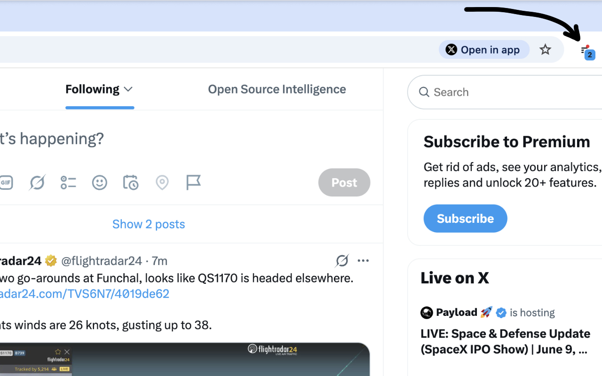
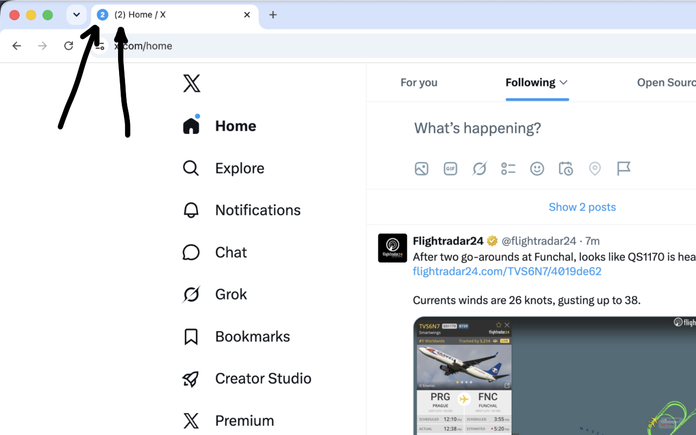
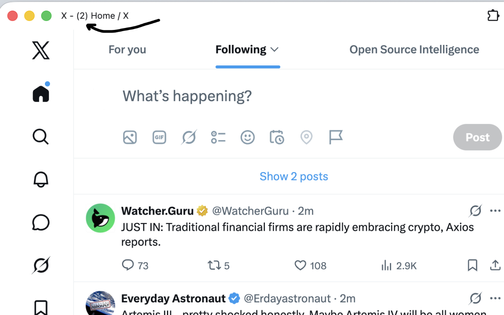
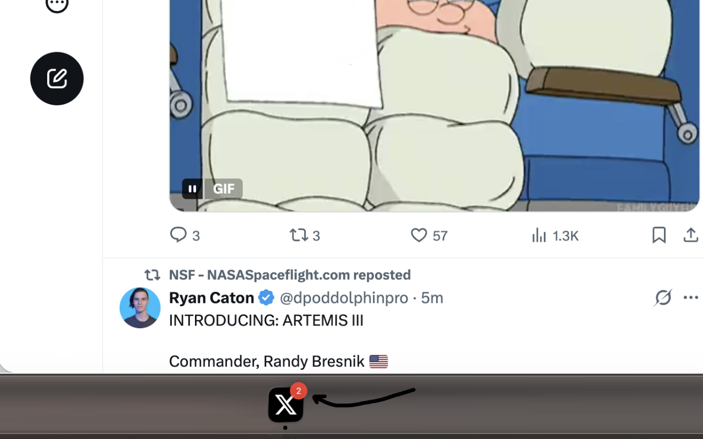
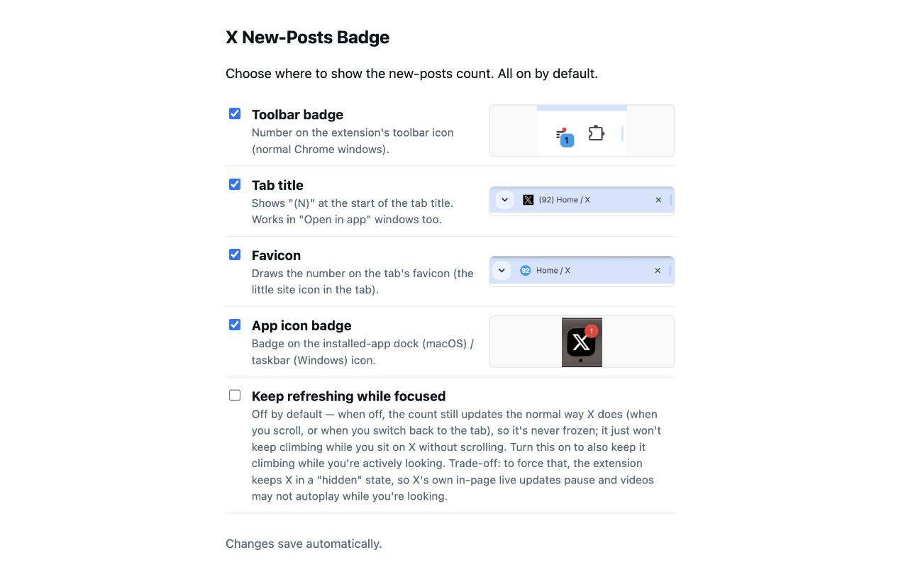

# X New-Posts Badge — see how many posts are waiting

**[➕ Add to Chrome — Chrome Web Store](https://chromewebstore.google.com/detail/x-new-posts-badge/odhcfgphdadkigoeiojogcifckikahkl)**

A small Chrome extension that shows the X (Twitter) home-timeline **"Show N posts"** count on your
**toolbar icon**, the **tab title**, the **favicon**, and the **installed-app (dock/taskbar) icon** —
so you can see how many new posts are waiting **without keeping X focused**.

X only updates that "Show N posts" pill when you come back to the tab, and it never shows it while
you're on another tab or app. This extension keeps the number live in the background and puts it
somewhere you can actually see it.

## Showcase

The same new-posts count, on every surface — each independently toggleable in the options.

**Toolbar badge** — the count on the extension icon while you browse:



**Tab title & favicon** — `(N) Home / X` in the tab title and the number on the favicon:



**"Open in app" window — title** — the count in the installed-app window's title:



**"Open in app" window — dock badge** — the count on the macOS dock / Windows taskbar icon:



**Settings** — turn each surface on or off independently:



## Install

The easiest way is from the **[Chrome Web Store](https://chromewebstore.google.com/detail/x-new-posts-badge/odhcfgphdadkigoeiojogcifckikahkl)** — click **Add to Chrome** and you're done. Then open [x.com/home](https://x.com/home) and log in.

### Or load unpacked (from source)

1. Open `chrome://extensions`.
2. Turn on **Developer mode** (top right).
3. Click **Load unpacked** and select this folder (`x-new-posts-badge-chrome-extension`).
4. Open [x.com/home](https://x.com/home) and log in. That's it.

## What you get

Four surfaces, each toggleable in the extension's options (all **on** by default):

- **Toolbar badge** — the count on the extension's toolbar icon (normal Chrome windows).
- **Tab title** — `(N) Home / X` at the start of the tab title. Works in normal tabs **and** in X's
  "Open in app" / installed-app windows.
- **Favicon** — the number drawn on the tab's favicon (the little site icon in the tab strip).
- **App icon badge** — the count on the installed-app **dock icon (macOS)** / **taskbar icon
  (Windows)**, via the browser Badging API. Only visible when X is installed as an app. On macOS the
  X app also needs notification permission — see
  [Troubleshooting](#the-dock-badge-doesnt-show-on-macos).

The count **mirrors X's own pill exactly** and clears to 0 when X clears it (you click the pill or
scroll to the newest post). Large counts show as `99+`.

## How it works

All verified live by inspecting X:

1. **The signal.** The new-posts count comes from X's `HomeLatestTimeline` request (a GraphQL call X
   makes over XHR). The displayed number is X's running total of new non-cursor timeline entries
   (tweets and conversation modules); it isn't a single field in any response, and X doesn't render
   the pill at all while the tab is hidden.
2. **Forcing a refresh in the background.** X only refetches `HomeLatestTimeline` on a
   Page-Visibility → focus transition, and only after the tab has been continuously hidden for about
   **60 seconds**. The extension reproduces that transition with synthetic visibility/focus events
   (no real tab switching), so the count stays fresh while you're away.
3. **Counting.** It reads the count from the response (new `tweet-` and `home-conversation-` entries,
   ignoring pagination cursors and promoted/ad entries) and accumulates it while you're away. When
   you focus the tab, it reconciles to X's real on-screen pill, so the number always matches X.
4. **Surfaces.** The tab title, favicon, and app-icon badge are driven from the page itself; the
   toolbar badge is set by the extension's service worker.

Because the count must be refreshed on a timer that survives Chrome's background-tab throttling, the
cadence is driven by **`chrome.alarms`** (page timers get throttled when a tab is in the background).
The page-context work (the visibility override and the response read) runs in the **MAIN world**; an
isolated content script bridges it to the service worker.

**Foreground is passive:** while you're actually looking at X, the extension doesn't force anything —
it just mirrors the pill X already shows.

## Settings

**Click the extension's toolbar icon** to open the settings page (it has no popup — the click goes
straight to Options). You can also right-click the icon → **Options**, or use `chrome://extensions` →
Details → Extension options. Changes apply immediately and are remembered with `chrome.storage.sync`.

- **Four surface toggles** (all on by default): toolbar badge, tab title, favicon, app icon badge.
- **Keep refreshing while focused** (off by default): when off, the count still updates the normal way
  X does — when you scroll or switch back to the tab — so it's never frozen; it just won't climb while
  you sit on X without scrolling. Turn it on to also keep the count climbing while you're actively
  looking. Trade-off — to force that, the extension keeps X in a "hidden" state, so X's own in-page
  live updates pause and videos may not autoplay while you're looking.

## Troubleshooting

### The dock badge doesn't show on macOS

The toolbar badge, tab title and favicon work, but the X app's **dock icon** shows no number.

**Why:** since Chrome 152, Chrome only shows an installed web app's dock badge if **macOS has given
that app notification permission**. Without it the badge is silently dropped — no error, nothing on
the dock. On some Macs Chrome hasn't yet switched on the part that lets the app *ask* for that
permission, so **X never appears in System Settings → Notifications** and there's nothing to allow.

**Check first:** open **System Settings → Notifications**. If **X** is listed, turn on **Allow
notifications** and **Badge application icon** — that's all you need.

**If X isn't listed — one-time fix:**

1. In a normal Chrome tab on [x.com](https://x.com), click the site-settings icon in the address bar
   and set **Notifications** to **Allow**.
2. Quit Chrome completely (**Cmd+Q**), then run this in Terminal:
   ```sh
   open -a "Google Chrome" --args --enable-features=AppShimNotificationAttribution
   ```
3. Open the **X app** from the dock, press **Cmd+Option+J** to open its console, and run:
   ```js
   new Notification('X New-Posts Badge', { body: 'Allow so the dock badge can show.', tag: 'xnpb-' + Date.now() })
   ```
4. macOS asks **"X would like to send you notifications"** → click **Allow**. X now appears in System
   Settings → Notifications.
5. Quit Chrome and start it normally. The permission is remembered by macOS — the Terminal flag is
   only needed once.

Don't want X pop-ups? In **System Settings → Notifications → X**, set the alert style to **None** and
keep **Badge application icon** on — the dock badge keeps working.

If macOS still doesn't ask in step 4, uninstall the X app (**⋮ → Uninstall**, leave "Also clear data"
**unticked**), reinstall it from x.com, and repeat steps 2–5.

## Testing

`test/harness.html` is an offline test page that exercises the engine's logic (entry counting, the
`99+` cap, pill reading, the three surfaces, settings gating, and background-accumulate /
foreground-reconcile) with inline assertions — no network and no real X needed.

```sh
# from this folder
python3 -m http.server 8754
# then open http://localhost:8754/test/harness.html in a FOCUSED window — the page shows pass/fail.
# (Run it in a foreground tab; background tabs throttle timers and skew timing-sensitive checks.)
```

For end-to-end behavior, load the extension unpacked, open `x.com/home`, switch to another tab for a
minute or two, and watch the surfaces update; then click X's "Show N posts" pill and confirm they
clear.

## Scope

Home timeline only (`x.com/home`, `twitter.com/home`). It does nothing on other X pages. No accounts,
no servers, no data collection.

## Versions

### v1.0.0 — first release
- Surfaces the home-timeline "Show N posts" count on three toggleable surfaces: toolbar badge, tab
  title/favicon, and the installed-app (dock/taskbar) icon — all on by default.
- Keeps the count live while the tab is backgrounded by reproducing X's own
  visibility-driven `HomeLatestTimeline` refresh with synthetic events (~60s cadence via
  `chrome.alarms`).
- Count mirrors X's pill exactly (new `tweet-` / `home-conversation-` entries, excluding cursors and
  promoted/ads), clears when X clears it, caps display at `99+`.
- Foreground stays passive (mirrors X's real pill). Home timeline only. No data collected.
- Offline test harness (`test/harness.html`).

## Contributing

Contributions and bug reports are welcome. It's a small extension with **no build step** — plain
vanilla JavaScript across `src/engine.js` (page-context engine), `src/bridge.js` (relay), and
`src/sw.js` (service worker).

- Before changing behavior, run `test/harness.html` in a **focused** tab and keep it green.
- Found a case where the count is wrong or a surface doesn't clear? Open an issue with the steps.
- For larger changes, please open an issue to discuss first.

## Acknowledgements

- Built as a [Manifest V3](https://developer.chrome.com/docs/extensions/develop) extension for
  **Google Chrome**.
- Operates on the **X** (formerly Twitter) web app.
- No third-party libraries — plain vanilla JavaScript.

**Not affiliated with, endorsed by, or sponsored by X Corp or Google LLC.** "X" and "Twitter" are
trademarks of X Corp; "Google Chrome" is a trademark of Google LLC. This is an independent,
unofficial project.

## Privacy

No data is collected, stored, or transmitted — no analytics, no tracking, no network requests of its
own. See [PRIVACY.md](PRIVACY.md).

## License

MIT — see [LICENSE](LICENSE).
